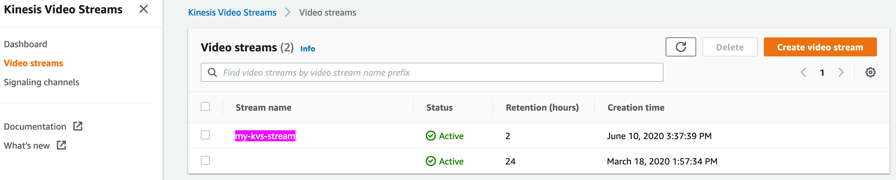

# Kinesis Video Stream demo

## Get your AWS account Credentials

Kinesis Video Streams SDK will require your IAM user’s access and secret Keys to authenticate and stream the video appropriately to your AWS account. Additionally, you will need to update the policy for that IAM user to enable access for Kinesis Video Streams APIs. For this workshop, we recommend that you create a new IAM user and associate the Kinesis Video Streams Full access policy to it. In order to do that, please follow the following steps:
1.	Sign in to the AWS Management Console and open the IAM console at https://console.aws.amazon.com/iam/.
2.	In the navigation pane, choose Users and then choose Add user.
3.	Type the user name for the new user (This will become the sign-in name for AWS). Check both Programmatic access and AWS Management Console access fields. Pick a Custom console password. To avoid the need to pick a new password when you first log-in to the console, uncheck the Require password reset field.
4.	Click Next:Permission
5.	Go to Attach existing policies directly tab and search for “KinesisVideoStreams”. Check the full access Policy- AmazonKinesisVideoStreamsFullAccess and hit Next:Tags.
6.	Skip Tag Creation and hit Next:Review and click Create user.
7.	You have created a new user successfully. You will see Access key ID and Secret access key on this screen.
8.	Please note down the access key ID and secret access key. You can also **download the CSV file** with these credentials for future reference.


## Compile the KVS producer code

Open [cloud9](https://console.aws.amazon.com/cloud9/) console and , install the dependences:


```
sudo apt-get update
sudo apt-get install -y cmake git gcc g++ autoconf
sudo apt-get install -y libssl-dev libcurl4-openssl-dev liblog4cplus-dev pkg-config
```

Download code from GitHub:

```
git clone --recursive https://github.com/awslabs/amazon-kinesis-video-streams-producer-c.git
```

Compile

```
cd amazon-kinesis-video-streams-producer-c/
mkdir build
cd build/ 
cmake .. && make
```
## Start Streaming to Kinesis Video Streams

### Setting environmental variables.

You can find those in the downloaded file, which described in "Get your AWS account Credentials" step 8.

```
export AWS_SECRET_ACCESS_KEY=xxx
export AWS_DEFAULT_REGION=xxx
export AWS_ACCESS_KEY_ID=xxx
```

### start to put media
```
./kvsAacAudioVideoStreamingSample my-kvs-stream 6000
```


### media playback
Kinesis Video Streams console can playback video
1.	Sign in to the AWS Management Console and open the IAM console at https://console.aws.amazon.com/kinesisvideo/.
2.	In the navigation pane, choose Video streams and then choose my-kvs-stream.



4.	Click Media playback
5.	You will see the media playback.


6. Additionally, we recommend you to try other test page in advance.

   https://aws-samples.github.io/amazon-kinesis-video-streams-media-viewer/


## Done


You are done with the KVS demonstration and are ready to move to [Lab 2]