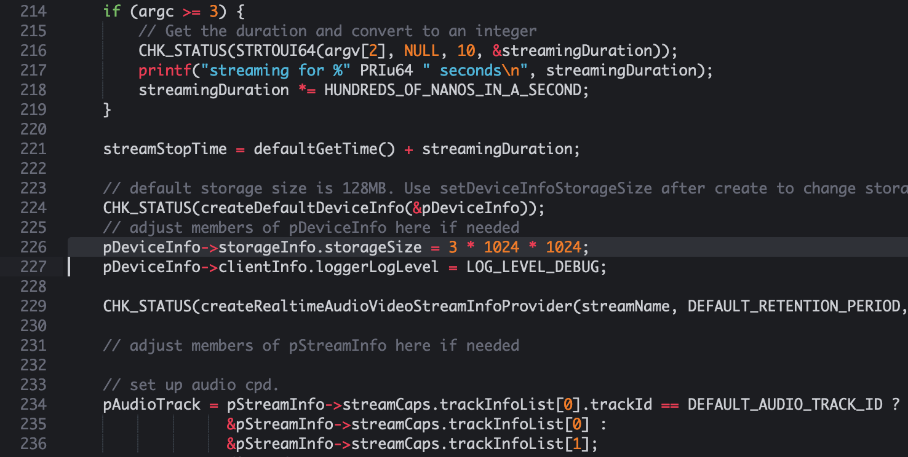
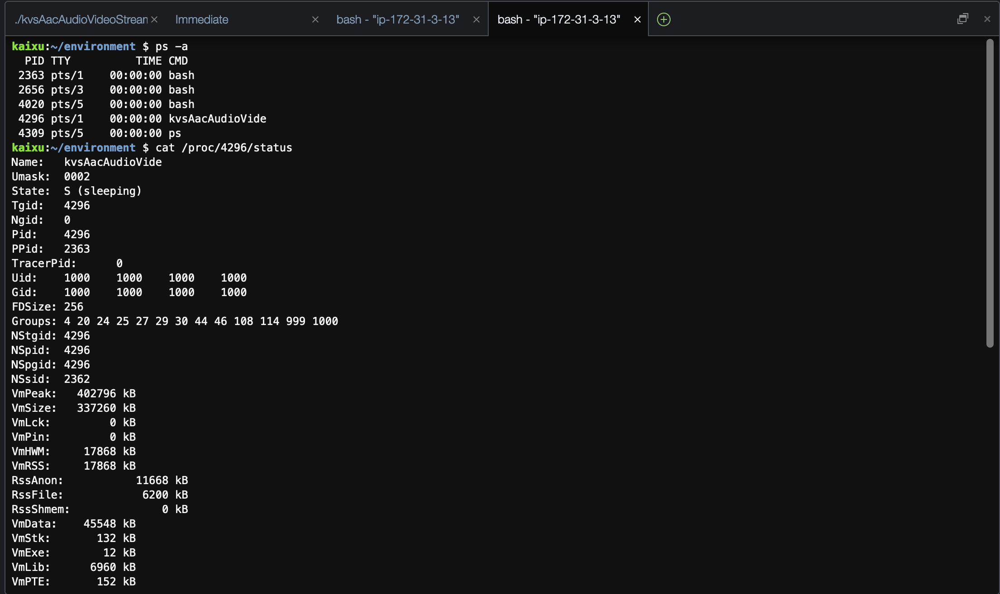
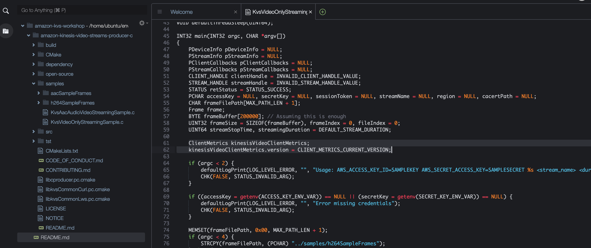
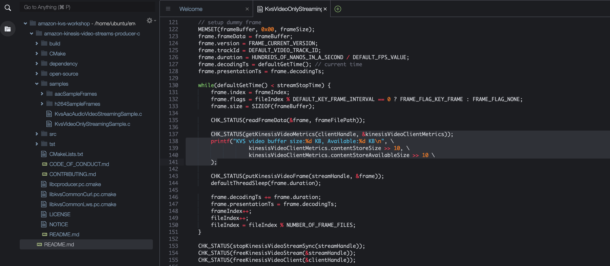
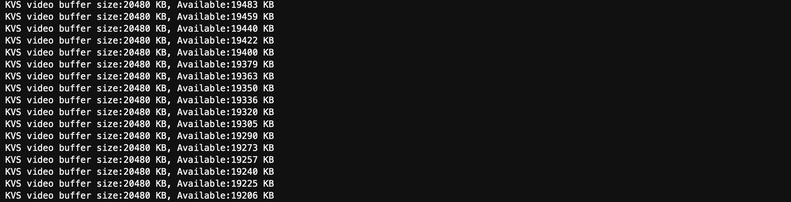

# Lab 2 - Customize by yourself

## reduce buffer size

Default storage size(mostly video buffer) is 128MB, which is should be able to buffer up to 120s video data. But embeded device usually don't have enough RAM. So let's change it to reduce RAM consumption.

1. Double click on `amazon-kinesis-video-streams-producer-c/samples/KvsAacAudioVideoStreamingSample.c` 
2. add code after line `CHK_STATUS(createDefaultDeviceInfo(&pDeviceInfo));`:
```
pDeviceInfo->storageInfo.storageSize = 2 * 1024 * 1024; 
CHK_STATUS(setDeviceInfoStorageSize(pDeviceInfo, pDeviceInfo->storageInfo.storageSize));
```



3. Save, make and test.
```
cd build
make
./kvsAacAudioVideoStreamingSample my-kvs-stream 6000
```
4. Checking
After setting `storageSize` to 2MB, we can finger out the RAM comsuption like this:



VmRSS is the RAM consumption. 

> PS: You can reduce the `storageSize` down to 1MB, but we don't recommand, because  the application will too sensitive to the network connection quality if you do so. Setting `storageSize` to 3-5MB on resource limited device is recommanded.


## change to mbedTLS

Furthermore, we can reduce the RAM consumption by change the default OpenSSL to MbedTLS.


```
cmake .. -DUSE_OPENSSL=OFF -DUSE_MBEDTLS=ON
make
export LD_LIBRARY_PATH=~/environment/amazon-kinesis-video-streams-producer-c/open-source/lib:$LD_LIBRARY_PATH
./kvsAacAudioVideoStreamingSample my-kvs-stream 6000
```


## Deep dive into KVS producer

There are some usefull information, AKA Metrics in KVS, like `Currently available storage size in bytes`, need to deep dive into code. We can leverage it to handle network traffic jam.

1. We change to another sample, double click on amazon-kinesis-video-streams-producer-c/samples/KvsVideoOnlyStreamingSample.c 
2. add one line after line 60, ` UINT64 streamStopTime, streamingDuration = DEFAULT_STREAM_DURATION;
`:
```
    ClientMetrics kinesisVideoClientMetrics;
    kinesisVideoClientMetrics.version = CLIENT_METRICS_CURRENT_VERSION;
```


3. add one line after line 137, ` CHK_STATUS(readFrameData(&frame, frameFilePath));`:
```
    CHK_STATUS(getKinesisVideoMetrics(clientHandle, &kinesisVideoClientMetrics));
    printf("KVS video buffer size:%d KB, Available:%d KB\n", \
            kinesisVideoClientMetrics.contentStoreSize >> 10, \
            kinesisVideoClientMetrics.contentStoreAvailableSize >> 10 \
    );
```



4. Save, make and test.
```
cd build
make
./kvsVideoOnlyStreamingSample your-kvs-name 600 ../samples/h264SampleFrames/
```

5. Checking



The `available storage size` is very important when the SDK encounters a stream latency condition. user application need to check this parameter frequently and reduce video bit rate or frame per second under such condition. 


## Done

You are done with the Customize and are ready to move to [Lab 3]({{ "/lab/lab-3" | absolute_url }})

You can go to [Lab 2.1]({{ "/lab/lab-2-1" | absolute_url }}) if this workshop is 2 hours long rather than 1 hour.