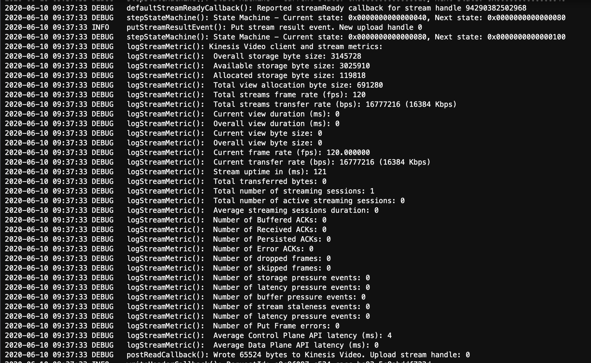

# Debug

## Log, verbose log!

```
export AWS_KVS_LOG_LEVEL=1
```




## Dump video in mkv format to local

```
export KVS_DEBUG_DUMP_DATA_FILE_DIR=$PWD
```


## Cloudwatch metrics. But *no log, only graphics.*


## CLI: aws kinesisVideo

```
# get reader endpoint
aws kinesisvideo get-data-endpoint --api-name GET_MEDIA_FOR_FRAGMENT_LIST --stream-name my-kvs-name --region us-west-2
# ListFragments
aws kinesis-video-archived-media list-fragments --stream-name my-kvs-name --endpoint https://b-647daf39.kinesisvideo.us-west-2.amazonaws.com --region us-west-2 --fragment-selector "FragmentSelectorType=PRODUCER_TIMESTAMP,TimestampRange={StartTimestamp=1588030831,EndTimestamp=1588031971}"
# GetMediaForFragmentList
aws kinesis-video-archived-media get-media-for-fragment-list --stream-name my-kvs-name --fragments='["91343852333181432595704229070926822931608131393"]' 'out.mkv' --endpoint https://b-647daf39.kinesisvideo.us-west-2.amazonaws.com --region us-west-2
```


## ListFragments API (not include)

https://docs.aws.amazon.com/kinesisvideostreams/latest/dg/API_reader_ListFragments.html


## Done


You are done with the debugging and are ready to move to [Lab 4]