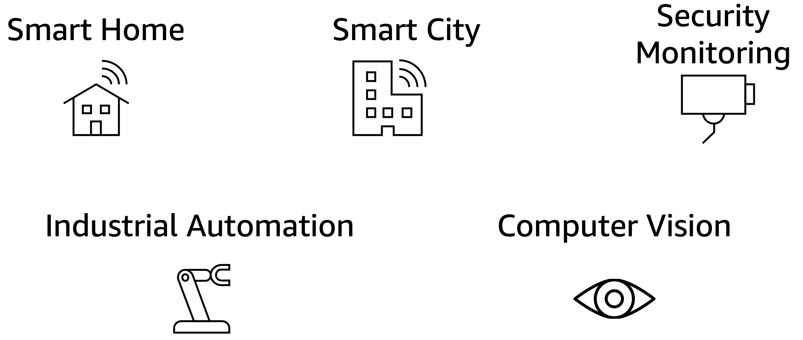
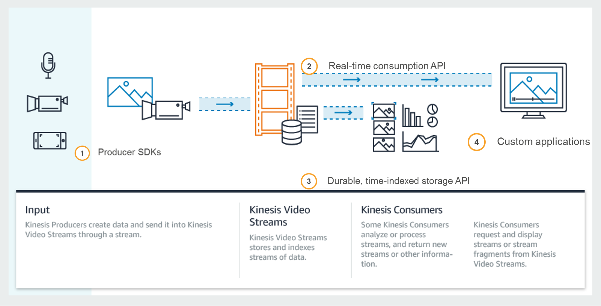
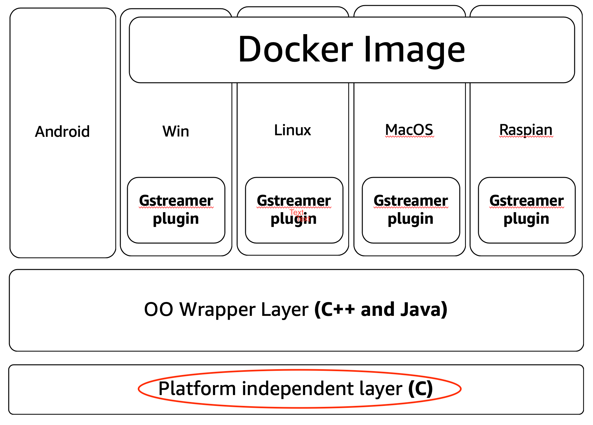

# KVS C producer workshop

>For those workshop continued for two hours need to go through the Labs with star(*),
>One hour workshop should skip them.

## Start here
https://iotlabtpe.github.io/iotlab_kvs_workshop/

## **Workshop Objectives**

- Work through the video ingestion data pipeline and playback of Video
- Focus on Kinesis Video Stream(KVS) C producer
- Playback video using HTTP Live Streaming (HLS) capability 
- Demonstrate how to customize KVS producer C sdk for embedded device and debug

## Target Audience
- IoT Architects/Proserv/TAMs, Embeded Software Developers / Engineers
- Interested in building video oriented workflows from devices and fine tuning for real world  
- Level 300 – Working knowledge of core AWS services
- Sample code will be provided
- A desire to learn

## What prior knowledge do I need?
- Working knowledge of some AWS foundational technologies:
  - AWS IAM 
  - AWS Cloud9 
  - Amazon CloudWatch 

## Workshop Set Up Steps 
- Ensure you have a valid AWS account with appropriate access
- Ready access to your AK/ Secret AK (to help with SDK installs) 
- Your laptop with Windows, MacOS, or Ubuntu Linux

## Video is critical to many applications
There are billions of connected edge devices in our homes, offices, cars, planes, factories, and just about everywhere. Increasingly, these edge devices have embedded cameras that capture video, audio, as well as other sensor data. In addition to edge devices, there are lots of industrial sources of time-encoded data such as satellites, RADARs, and depth sensors. Streaming this data to the cloud for analytics will be critical to applications that power robots, smart cities, manufacturing automation, security monitoring, and machine learning (ML). 

## Building a video system is complex

- Cumbersome to rewrite code for various devices and development environments
- Difficult to “elastically” scale to millions of devices
- Requires reliable support for cadence, latency, and jitter on streams 
- Requires secure streaming and storage by default 
- Need easy-to-use APIs to retrieve, replay, and process video at any scale

## Amazon Kinesis Video Streams Concept

- The SDK packages the frames and fragments that generate and use its (transform layer security protocol) to send the data and provide data integrity., as a video stream in, we have 2 APIs for consumers:

    1. Handles streaming *PutMedia* API to stream continuously in a reliable manner.

    2. *GetMedia* API to access fragments or frame level apis to process for low-level latency. 

- Since we store all the data and customer can store from 0, hours to year so the api allows you to reply process already captured data. 

- Kinesis Video will automatically will encrypt the data (KMS) or encryption key customers provide. But if not, KVS use its own keys.

- The last phase, we provide parsing utility where customers can use easily use 

*Summary*: input time encoded data, cameras, videos, cameras on drones. As the data stream in via the producer SDK, and then customers build their own application using our SDK APIs.

**Device SDKs to Securely Stream Data from Edge Devices** 

Kinesis Video Streams provides SDKs that you can download [LINK TO DOWNLOAD] and install on your connected camera device and write a few lines of code to securely stream video, audio, and other time-encoded data to Kinesis Video Streams for analytics and storage. The SDKs, which are available for popular device-oriented development environments such as Android and Java, receive data from the device’s media source and manage the entire lifecycle of the stream as it is transmitted from the media source to the Kinesis video stream. Once you have written the code for a given device, you can re-use it for other devices with minor changes. 

**Automatic Data Encryption in Transit and at REST**

Kinesis Video Streams SDKs package the frames and fragments generated by the device’s hardware for secure streaming using Transport Layer Security (TLS), a protocol that provides privacy and data integrity between two communicating applications. Kinesis Video Streams automatically encrypts the data you put into your video streams using AWS Key Management Service (KMS), helping you protect your data at rest. Data is encrypted before it is written to the Kinesis Video Streams storage layer, and it is decrypted after it is retrieved from storage. As a result, your data is always encrypted at rest within the stream. 

**APIs for Real-time and Batch Data Retrieval**

Kinesis Video Streams offers easy-to-use APIs that allow you to retrieve the data from your streams on a frame-by-frame basis for building real-time and batch processing. For more information, see documentation. 

**Durable Storage**

Acuity uses Amazon S3 as the underlying data store, which means your data is stored durably and reliably. You can set and control retention periods on a per-stream basis, allowing you to cost-effectively store the data in your streams for a limited time period or indefinitely. You can change the stream retention period at any point. 

**Video Stream Parsing Utilities**

Kinesis Video Streams offers a library that you can use within your applications to easily retrieve frame-level objects, extract and collect meta-data attached to fragments, merge consecutive fragments, and more. It allows you to focus on building your application by taking care of data transformations necessary to retrieve fragments from your streams. 

## Kinesis Video Streams Producer 
> Easily connect and stream from camera sources

## Kinesis Video Streams Producer C SDK 
> Perfect for resource limited camera devices, especially those RTOS based.

OK, let's start from [Lab 0 - Setup the Labs]

